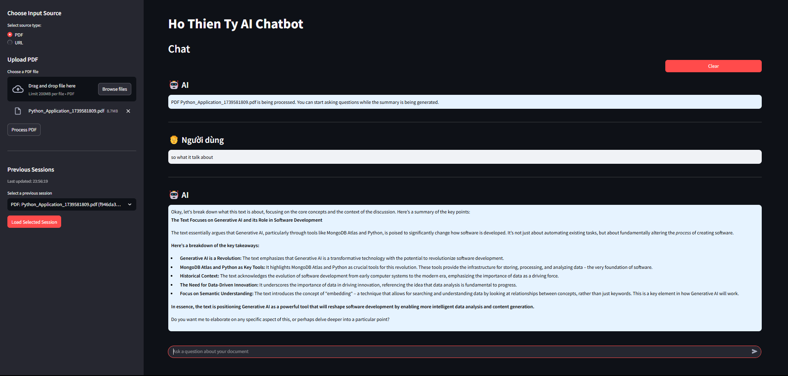
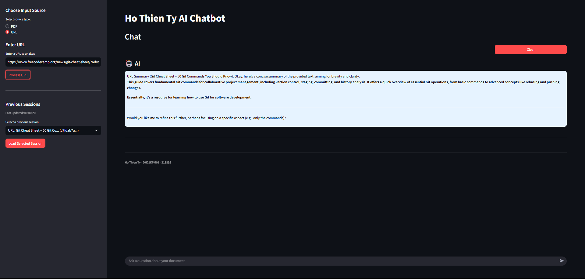
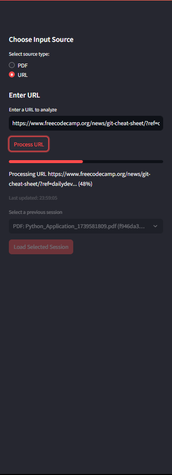

# CHATBOT-ANALIZING-SUMARIZING-PDF-URL

Developed by Ho Thien Ty  
Contact: tytybill123@gmail.com (for full Source Code)

Transforming documents into insights, effortlessly engaging conversations.

  

Built with the tools and technologies:

  
<!-- These technologies are confirmed to be used in the codebase -->

  

# AI Assistant for PDF and URL Content

## Screenshots

*PDF processing interface showing document upload and interaction*

*URL processing interface displaying webpage content extraction*

*Component architecture diagram showing system integration*

## Objective
This project aims to create an AI-powered chatbot with the following goals:
1. Process and summarize PDF documents and URL content for quick insights.
2. Enable contextual conversations based on document and webpage content.
3. Store chat history for future reference.
4. Provide an intuitive interface for users.
5. Manage multiple chat sessions efficiently.

These objectives focus on simplifying document analysis and enhancing interaction for users like students, researchers, or professionals working with various content sources.

## Methodology
The system is built using a client-server model:

### Backend Design
- **API**: FastAPI handles RESTful endpoints for document, URL, and chat operations.
- **Authentication**: API keys secure access to services.
- **Storage**: SQLite saves chat sessions and document data.
- **PDF Processing**: PyPDF and related libraries extract text from PDFs.
- **URL Processing**: Web scraping tools extract content from webpages.
- **AI Engine**: Integration with LLM models processes text and generates responses.

### Frontend Design
- **Interface**: Streamlit creates a web-based UI.
- **Context**: Session state tracks conversation flow.
- **Connectivity**: HTTP requests link to backend APIs.

### Process
- User uploads a PDF or enters a URL via Streamlit.
- Backend extracts text, generates a summary, and stores it.
- User asks questions; AI responds using document or webpage context.
- Chat history is saved for continuity.
- Multiple sessions can be managed and switched between.

The system was developed by first building and testing separate PDF and URL APIs, then integrating the AI models, and finally designing the UI with session management capabilities.

## Tools
- **Backend**: FastAPI, SQLite, LLM integration, PyPDF libraries, web scraping.
- **Frontend**: Streamlit, Requests.

These tools were selected for their efficiency, open-source nature, and compatibility with the project's needs for handling both PDF and URL content.

## Results
The implementation achieved:
1. Secure APIs: Endpoints require API keys.
2. Content Processing: Extracts text and summarizes PDFs and webpages.
3. Chat Functionality: Delivers context-aware replies with saved history.
4. User Interface: Streamlit UI is simple and effective.
5. Session Management: Allows users to switch between different documents and webpages.

### Challenges
- Content extraction: Implemented robust methods for handling various PDF formats and webpage structures.
- Session management: Developed efficient database design for tracking multiple conversations.
- Frontend-backend integration: Ensured seamless communication between components.
- Response speed: Optimized for reasonable response times across different content types.

### Performance
- Processing Time: PDF - 10-30 seconds for 10 pages; URL - 5-15 seconds per webpage.
- Response Time: 7-10 seconds per query depending on content complexity.
- Resources: Peaks at 3-4GB RAM, 60-80% CPU utilization during processing.

## Future Plan
1. Short-term: Add more content filtering options and improve summary quality.
2. Mid-term: Support additional file formats beyond PDF.
3. Long-term: Implement more advanced context-awareness and multi language support.

## GitHub Repository
The repository includes all code, with separate directories for PDF backend, URL backend, and frontend, along with a comprehensive README for setup.

### Setup Guide
- **Requirements**: Python 3.8+, API key for LLM service, 8GB+ RAM.
- **Steps**:
  1. Clone the repository
  2. Install dependencies: `pip install -r requirements.txt`
  3. Configure API key in `.env` file
  4. Start PDF backend: `cd backend_PDF && uvicorn main:app --reload --port 8000`
  5. Start URL backend: `cd backend_URL && uvicorn main:app --reload --port 8001`
  6. Launch frontend: `cd frontend && streamlit run app.py`
  7. Access the application at: http://localhost:8501

## References
1. [FastAPI Documentation](https://fastapi.tiangolo.com/)
2. [Streamlit Documentation](https://docs.streamlit.io/)
3. LLM Integration Resources
4. PyPDF Documentation
5. Web Scraping Best Practices

## Conclusion
This report documents a comprehensive AI assistant system capable of processing both PDFs and URLs, combining document analysis with conversational AI. The modular architecture allows for future expansion and enhancement of the system's capabilities.

